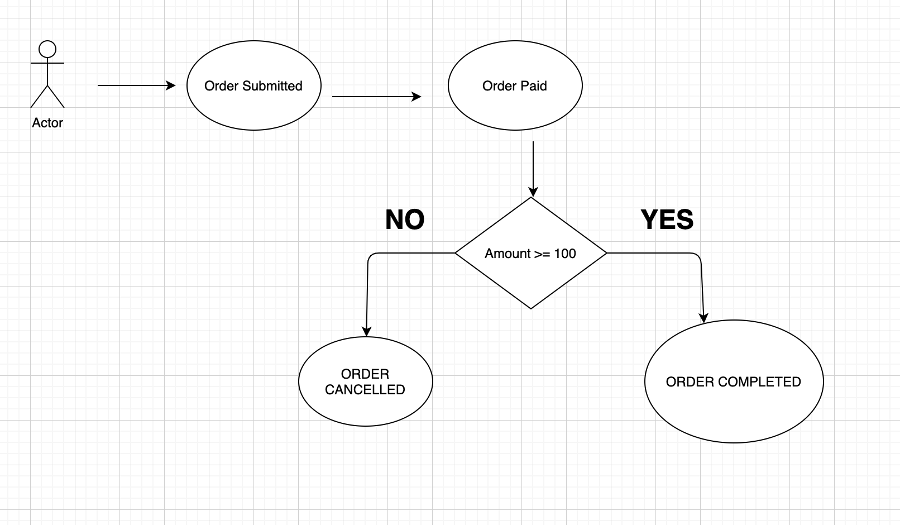

# springStateMachineDemo

Its just a small demo of spring state machine . Storing the transition states
in db .

Description: User will submit the order and if amount is >=100 the order will be 
processed and completed if order is less than 100 order will be cancelled.

